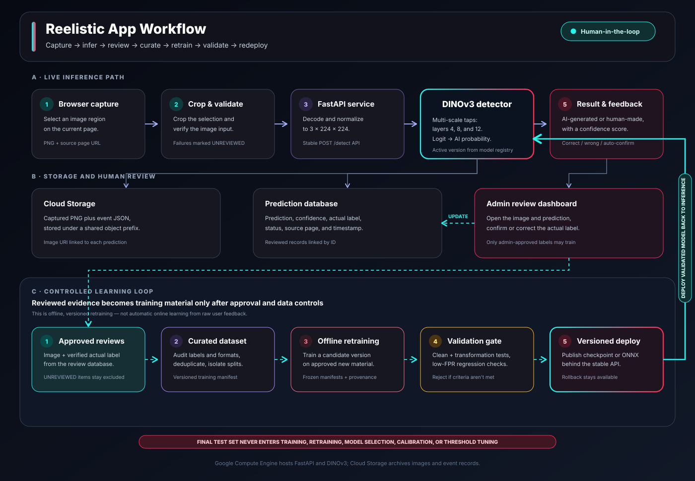
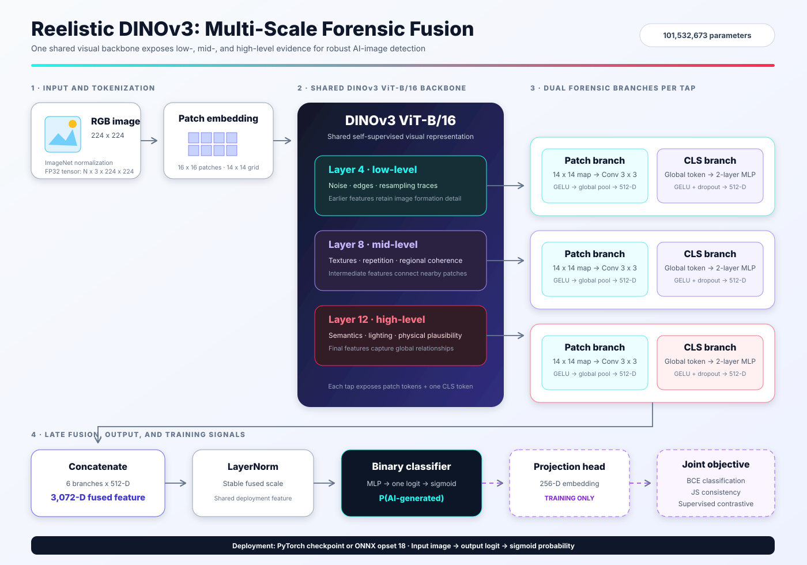
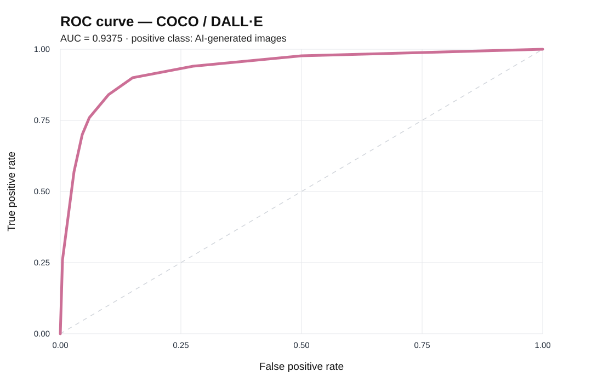
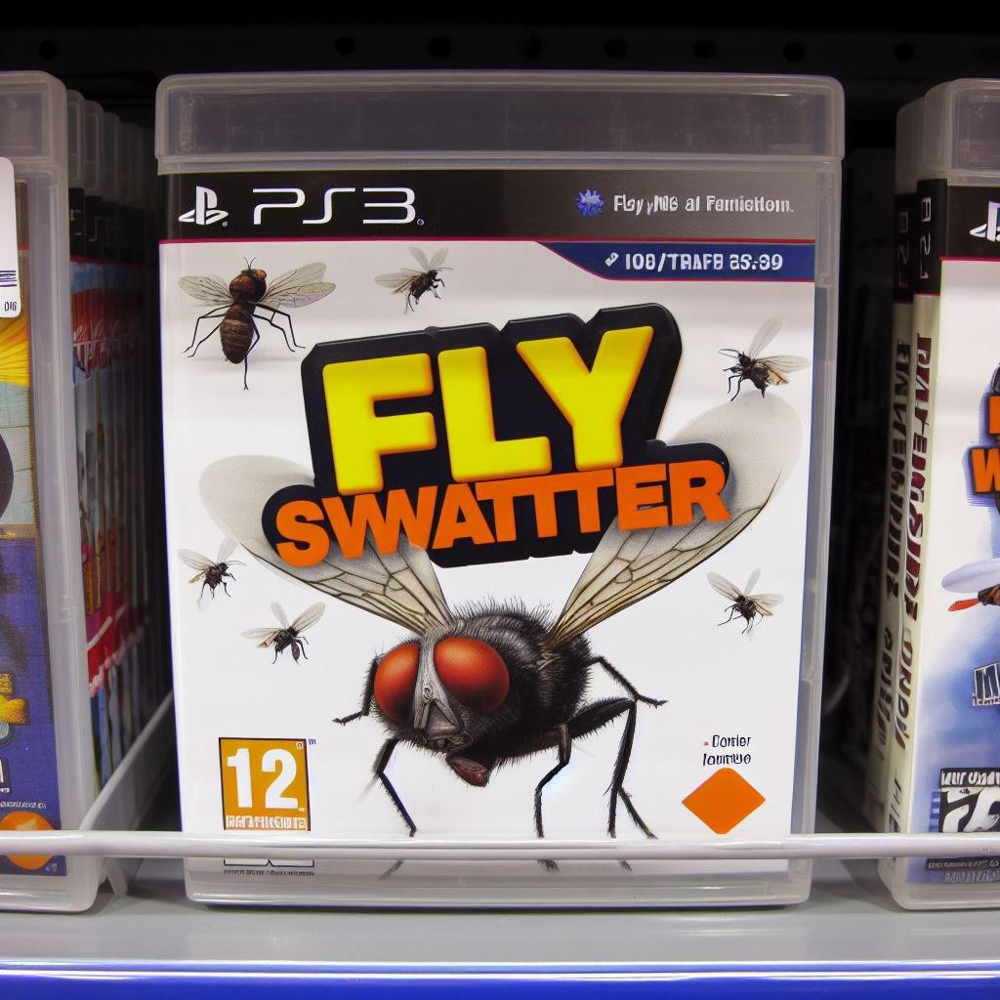
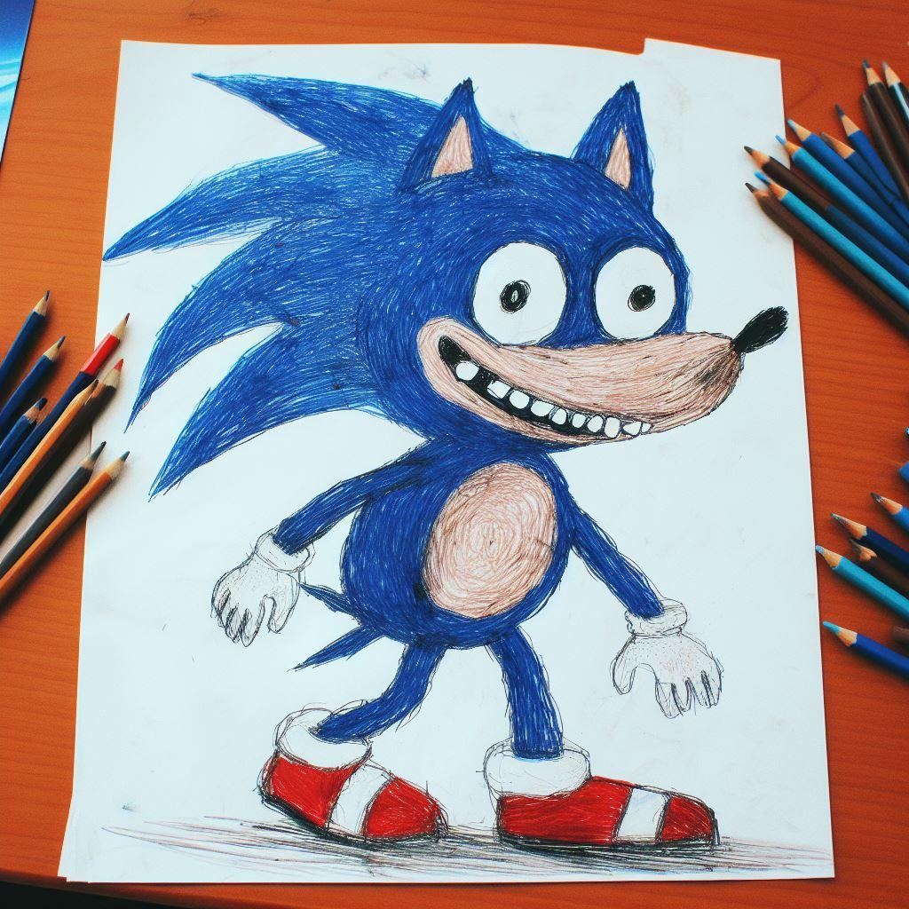
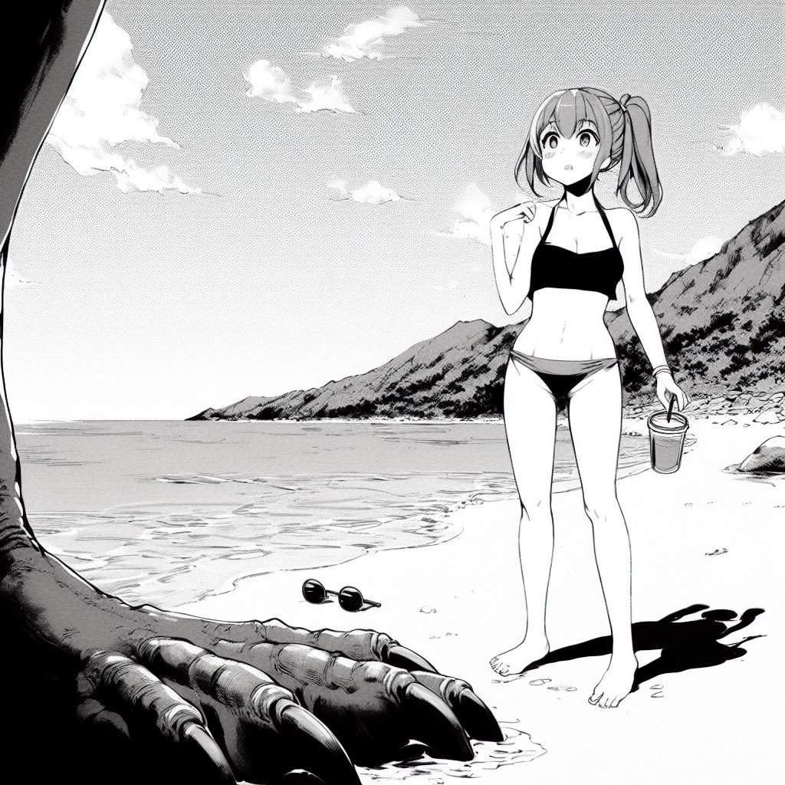

# Reelistic: Robust AI-Generated Image Detection

Reelistic is an end-to-end system for detecting AI-generated images after the kinds of transformations that happen on real platforms: JPEG recompression, blur, resizing, noise, color adjustment, and cropping. It combines a browser extension, a cloud-hosted inference API, a human-review dashboard, and a multi-scale DINOv3 forensic classifier.

## Quick start: run the ONNX model

The ONNX model is included in this branch through Git LFS. Clone the branch, then run the organiser script on any image:

```bash
git clone --branch codex/onnx-reviewer-quickstart \
  https://github.com/hippo2311/TikTokTechJam2026.git
cd TikTokTechJam2026
./scripts/run_organizer_demo.sh path/to/image.jpg
```

The script creates a local Python environment, installs the ONNX Runtime dependencies, retrieves the model with Git LFS if it is missing, and prints an `ai-generated` or `authentic` verdict. It uses the documented **0.9648** decision threshold (the clean COCO/DALL·E 5%-FPR operating point).

#### Verified example

With a local test image such as `data/test.png`, run from the project root:

```bash
git switch codex/onnx-reviewer-quickstart
./scripts/run_organizer_demo.sh data/test.png
```

Expected output:

```text
test.png: authentic (AI probability 0.7586; threshold 0.9648)
```

Install [Git LFS](https://git-lfs.com/) before cloning. If the clone was made without Git LFS, install it and rerun the script; it will retrieve the model automatically. To process a folder and save results:

```bash
./scripts/run_organizer_demo.sh path/to/images results.json
```

## What the app does

The browser extension lets a user drag over an image on a web page. It captures the visible tab, crops the selected region, validates the capture, and sends the image to the backend. The backend returns `ai-generated` or `human-made` with a confidence score.

The result stays lightweight for the user, while the full event is available to an administrator:

- The extension records the selected image, prediction, confidence, source page, and user feedback.
- If the user marks a prediction as wrong, the app infers the opposite actual label.
- If the user moves on without responding, the result is auto-confirmed after 10 seconds.
- Images that cannot be processed are retained as `UNREVIEWED` and excluded from model-quality metrics.
- The admin dashboard shows recent predictions, image previews, filters, accuracy over time, a confusion matrix, and review status.
- An admin can open a prediction, inspect the image and metadata, correct its status/actual label, and write the review back to the database.
- Admin-approved reviews can be curated into new training material for a later model version.



### Capture and inference flow

1. A user activates the extension and drags a rectangle over an image.
2. The extension captures the visible browser tab and crops the selected area to PNG.
3. `POST /detect` decodes and preprocesses the image to a normalized `3 x 224 x 224` tensor.
4. Reelistic DINOv3 returns one logit; `sigmoid(logit)` is the AI-generated probability.
5. The API stores the prediction and image reference, then returns a stable response to the extension.
6. User feedback or an admin correction is linked to the original prediction ID.

```json
{
  "id": 42,
  "verdict": "ai-generated",
  "confidence": 91,
  "note": "Reelistic DINOv3 probability"
}
```

### Dashboard, database, and hosting

The FastAPI service is hosted on Google Compute Engine. Captured images and event JSON are archived in Google Cloud Storage; structured prediction and feedback records are stored through SQLAlchemy. SQLite is used for the current prototype, while the same data layer can be pointed to PostgreSQL using `DATABASE_URL`.

The database keeps:

| Entity | Stored fields |
|---|---|
| Prediction | ID, predicted label, confidence, AI probability, Cloud Storage URI, timestamp |
| Feedback | Prediction ID, review status, actual label, original prediction, confidence, source page, timestamp |
| Image archive | Captured PNG and its matching prediction/feedback event JSON in Cloud Storage |

Only reviewed `CORRECT` and `WRONG` records contribute to accuracy, trend charts, and the confusion matrix. `UNREVIEWED` and processing-error records remain visible for investigation but do not change the reported metrics.

### Human-in-the-loop retraining

Feedback is not used for immediate online learning. A user review or admin correction is first written back to the prediction database and linked to the captured image. The administrator can then inspect the evidence and approve a reliable actual label.

Approved records form a candidate training pool. Before they can influence the model, the pool is:

1. audited for incorrect or ambiguous labels;
2. checked for supported and decodable image formats;
3. deduplicated against existing development and evaluation data;
4. assigned to a versioned training manifest without contaminating validation or test splits—the final test set remains permanently excluded;
5. used in an offline retraining run with the full clean and transformation evaluation suite.

A retrained checkpoint is deployed only if it improves the agreed validation criteria without unacceptable regression under transformations or at low false-positive operating points. The deployment remains behind the same `/detect` API, so the extension and dashboard continue to work without model-specific changes. This creates a controlled loop:

```text
Prediction → human/admin review → database → approved training pool
    → audit and deduplication → offline retraining and evaluation
    → versioned checkpoint/ONNX → cloud deployment → new predictions
```

Validation data may guide model selection, but final test data never enters this loop. After retraining, a new model must be selected using development/validation evidence before any one-time final-test evaluation.

## Development data and immutable audit

Reelistic was developed from **three independent datasets**: SID, CIFAKE (`birdy654`), and 13 approved WildFake generator families. The organizer's COCO-real/DALL·E reference set is evaluation-only and never enters training.

The completed source-pool audit produced the following immutable split inventory:

| Stage | Records | Purpose |
|---|---:|---|
| Training manifest | 1,589,846 | Source/class/family-balanced development pool |
| Validation manifest | 189,040 | Checkpoint selection and robustness comparison |
| Calibration manifest | 25,374 | Threshold and probability calibration only |
| Reserved CIFAKE test manifest | 19,962 | Development test, isolated from optimization |
| **Total unique, decodable records** | **1,824,222** | After audit and exclusions |

Before splitting, the audit decoded every candidate image, calculated a content SHA-256, removed `64,540` duplicate-content records, excluded `142` unreadable/corrupt files, retained dataset and generator-family provenance, and wrote deterministic train/validation/calibration/test manifests. When identical content appeared in more than one candidate split, the priority rule retained only one canonical record so byte-identical images could not cross split boundaries.

The current DINOv3 schedule does not traverse all 1.59M training rows every epoch. It draws a fresh source- and class-balanced sample of `120,000` records per epoch for 10 epochs, keeping every source and class eligible while bounding training time.

### Why the test deduplication guard matters

The external COCO/DALL·E test export itself contains repeated content. Its `13,841` paths (`4,998` COCO + `8,843` DALL·E) reduce to only `8,717` unique SHA-256 hashes: `5,124` paths are same-label DALL·E duplicates. The audit found **zero conflicting real/fake duplicate hashes** and **zero content-hash overlap with development data**, but counting every repeated path as independent would still give duplicated images extra weight in the final score. The smaller 250-image FN review sample independently contains seven duplicate-hash pairs (14 files), confirming that this is visible in the supplied error artifacts too.

Our guard hashes the bytes of every development and test image before evaluation, rejects any test image whose hash appears in train/validation/calibration/reserved-test data, rejects duplicate hashes with conflicting labels, and emits both the organizer path-level manifest and a one-row-per-content-hash manifest. The unique-content view effectively removes repeated test copies for an independence check; we retain the path-level view separately so the official organizer weighting remains reproducible. Final reporting should show both results instead of silently benefiting—or suffering—from repeated examples.

## The model: multi-scale DINOv3 forensics

The detector fine-tunes `facebook/dinov3-vitb16-pretrain-lvd1689m` and taps three depths of the ViT-B/16 backbone. A single final layer can over-specialize in semantics; the multi-scale design preserves evidence from lower-level image formation through higher-level scene consistency.



### Why layers 4, 8, and 12?

| Tap | Role in the detector | Examples of evidence |
|---|---|---|
| Layer 4 | Low-level forensic evidence | High-frequency noise, edge anomalies, resampling traces, pixel-grid irregularities |
| Layer 8 | Mid-level appearance evidence | Local texture consistency, repeated patterns, material coherence, regional structure |
| Layer 12 | High-level semantic evidence | Global composition, lighting consistency, object relations, anatomical and physical plausibility |

At every tapped layer, Reelistic uses two complementary views:

- **Patch branch:** patch tokens are reshaped to a `14 x 14` feature map, processed by a `3 x 3` convolution, GELU, and global pooling.
- **CLS branch:** the global CLS token passes through a two-layer MLP.

The six resulting 512-dimensional features are concatenated into a 3,072-dimensional representation, normalized, and passed to the binary classifier. A projection head is used by the supervised contrastive objective during training and is not required for deployment.

### Why one shared model is the stronger design

The earlier four-model ensemble divided texture, frequency, residual-noise, and semantic evidence across separately optimized networks. That looked interpretable, but it duplicated computation, produced branch scores with different calibration, and allowed the much larger semantic branch or the quality gate to dominate. A detector can then look strong on a familiar source while failing when a new generator or platform transformation changes the balance between branches.

Reelistic keeps the useful part of that idea—multiple kinds of evidence—but extracts them from **one shared representation**:

- one backbone pass supplies low-, middle-, and high-level features instead of running four unrelated encoders;
- every tapped feature lives in the same representation space, reducing cross-model scale and calibration mismatch;
- local patch heads and global CLS heads keep forensic detail and semantic consistency explicit until late fusion;
- the consistency and contrastive losses train the entire representation to survive platform transformations together;
- a failure can be traced to a layer tap or head without disentangling four independently trained checkpoints.

This is not a claim that one model is universally superior. It is a deliberate engineering trade-off: a simpler optimization surface and lower inference/training overhead in exchange for requiring careful multi-source validation. The preliminary internal-versus-competition AUC gap below is why we report that trade-off openly and select checkpoints using generalization evidence rather than clean accuracy alone.

### Compact today, scalable tomorrow

The DINOv3 ViT-B/16 backbone has `85,660,416` parameters (about **86M**). The complete detector—including all six forensic heads, normalization, classifier, and training-only projection head—has `101,532,673` parameters. That is only **5.08% of the 2B competition ceiling**, or about **19.7 times smaller** than the allowed maximum.

The compact model reduces the amount of state that must be optimized, stored, exported, and served. Training further uses FP16 mixed precision, gradient checkpointing, balanced 120k-sample epochs, and a lower learning rate for the pretrained backbone. These choices make repeated adaptation to new datasets substantially more practical than retraining a multi-model ensemble, although final GPU-hour, latency, throughput, and memory benchmarks are still pending.

The architecture is intentionally strict at its boundaries—RGB input, tapped hidden states, a 3,072-D fused feature, and one output logit—but configurable internally. The implementation obtains the backbone hidden size dynamically and takes tap locations and head widths from configuration. A larger DINO/ViT backbone, more taps, or wider heads can therefore reuse the same data, training, API, and ONNX pipeline. We can scale capacity when evidence justifies the cost without redesigning the browser extension, backend contract, evaluation suite, or human-review loop.

### Model specification

| Property | Value |
|---|---|
| Backbone | DINOv3 ViT-B/16 |
| Input | RGB, `224 x 224`, ImageNet normalization |
| Patch size | `16 x 16` |
| Layer taps | 4, 8, 12 |
| Fused feature size | 3,072 |
| Positive class | `ai_generated` |
| Backbone parameters | 85,660,416 (about 86M) |
| Complete detector parameters | 101,532,673 |
| Competition limit usage | 5.08% of 2 billion (about 19.7x below the limit) |
| Selection metric | Internal-validation TPR at 1% FPR |
| Deployment formats | PyTorch checkpoint and ONNX opset 18 |

### Training objective and robustness curriculum

The training objective combines binary classification with prediction consistency and supervised contrastive learning:

```text
L = BCEWithLogits + 0.5 x Binary-JS-Consistency + 0.1 x Supervised-Contrastive
```

Training uses source- and class-balanced batches from SID, CIFAKE, and approved WildFake data. Each augmented view receives one sampled transformation rather than a chain of transformations. The curriculum moves from easier to harder parameters while clean images remain the classification anchor.

| Transformation | Parameters evaluated |
|---|---|
| JPEG compression | Quality 90, 70, 50, 30 |
| Gaussian blur | Sigma 0.5, 1.0, 2.0 |
| Resize and upscale | Scale 0.5, 0.25 |
| Gaussian noise | Sigma 0.02, 0.05, 0.10 |
| Color jitter | Strength 0.10, 0.20 |
| Center crop | Keep 80% |

The organizer demonstration set is evaluation-only and is never added to training.

> **Strict test isolation:** the final test set is never used for initial training, feedback-based retraining, augmentation design, checkpoint selection, hyperparameter tuning, calibration, or threshold selection. It is evaluated only after the model and decision policy are frozen. No dashboard feedback record can be assigned to the final test manifest.

## Results
### Test results (In Domain) 

#### Set1: CIFake

| condition | count | roc_auc | accuracy | precision | recall | f1 | tpr_at_5_fpr | threshold_at_5_fpr |
| --- | --- | --- | --- | --- | --- | --- | --- | --- |
| clean | 20000 | 0.9996 | 0.9930 | 0.9893 | 0.9968 | 0.9930 | 0.9997 | 0.0385 |
| jpeg_q90 | 20000 | 0.9996 | 0.9926 | 0.9899 | 0.9954 | 0.9926 | 0.9995 | 0.0399 |
| jpeg_q70 | 20000 | 0.9995 | 0.9929 | 0.9894 | 0.9964 | 0.9929 | 0.9996 | 0.0400 |
| jpeg_q50 | 20000 | 0.9988 | 0.9863 | 0.9858 | 0.9868 | 0.9863 | 0.9974 | 0.0487 |
| jpeg_q30 | 20000 | 0.9971 | 0.9764 | 0.9843 | 0.9681 | 0.9762 | 0.9907 | 0.0548 |
| blur_sigma_0_5 | 20000 | 0.9990 | 0.9878 | 0.9944 | 0.9811 | 0.9877 | 0.9978 | 0.0319 |
| blur_sigma_1_0 | 20000 | 0.9983 | 0.9838 | 0.9824 | 0.9852 | 0.9838 | 0.9959 | 0.0761 |
| blur_sigma_2_0 | 20000 | 0.9963 | 0.9729 | 0.9727 | 0.9732 | 0.9730 | 0.9858 | 0.1440 |
| resize_0_5 | 20000 | 0.9982 | 0.9827 | 0.9799 | 0.9856 | 0.9828 | 0.9943 | 0.0830 |
| resize_0_25 | 20000 | 0.9886 | 0.9468 | 0.9442 | 0.9498 | 0.9470 | 0.9426 | 0.5889 |
| noise_sigma_0_02 | 20000 | 0.9995 | 0.9923 | 0.9907 | 0.9940 | 0.9924 | 0.9996 | 0.0392 |
| noise_sigma_0_05 | 20000 | 0.9992 | 0.9899 | 0.9891 | 0.9908 | 0.9900 | 0.9982 | 0.0392 |
| noise_sigma_0_10 | 20000 | 0.9981 | 0.9821 | 0.9831 | 0.9812 | 0.9821 | 0.9948 | 0.0687 |
| color_jitter_0_20 | 20000 | 0.9992 | 0.9908 | 0.9871 | 0.9946 | 0.9908 | 0.9990 | 0.0463 |
| center_crop_0_80 | 20000 | 0.9985 | 0.9849 | 0.9848 | 0.9851 | 0.9850 | 0.9974 | 0.0586 |


#### Set2: SID
| condition | count | roc_auc | accuracy | precision | recall | f1 | tpr_at_5_fpr | threshold_at_5_fpr |
|---|---:|---:|---:|---:|---:|---:|---:|---:|
| clean | 24000 | 0.9975 | 0.9841 | 0.9880 | 0.9882 | 0.9881 | 0.9936 | 0.1067 |
| jpeg_q90 | 24000 | 0.9971 | 0.9837 | 0.9868 | 0.9888 | 0.9878 | 0.9930 | 0.1469 |
| jpeg_q70 | 24000 | 0.9969 | 0.9835 | 0.9846 | 0.9908 | 0.9877 | 0.9936 | 0.2031 |
| jpeg_q50 | 24000 | 0.9979 | 0.9871 | 0.9911 | 0.9895 | 0.9903 | 0.9950 | 0.0786 |
| jpeg_q30 | 24000 | 0.9975 | 0.9827 | 0.9922 | 0.9818 | 0.9869 | 0.9920 | 0.0723 |
| blur_sigma_0_5 | 24000 | 0.9976 | 0.9845 | 0.9890 | 0.9877 | 0.9884 | 0.9939 | 0.0919 |
| blur_sigma_1_0 | 24000 | 0.9974 | 0.9838 | 0.9893 | 0.9864 | 0.9878 | 0.9928 | 0.1052 |
| blur_sigma_2_0 | 24000 | 0.9971 | 0.9825 | 0.9883 | 0.9853 | 0.9868 | 0.9914 | 0.1366 |
| resize_0_5 | 24000 | 0.9973 | 0.9840 | 0.9898 | 0.9861 | 0.9879 | 0.9924 | 0.1072 |
| resize_0_25 | 24000 | 0.9921 | 0.9658 | 0.9751 | 0.9732 | 0.9741 | 0.9789 | 0.2025 |
| noise_sigma_0_02 | 24000 | 0.9974 | 0.9832 | 0.9872 | 0.9875 | 0.9873 | 0.9931 | 0.1154 |
| noise_sigma_0_05 | 24000 | 0.9968 | 0.9794 | 0.9850 | 0.9834 | 0.9842 | 0.9908 | 0.1397 |
| noise_sigma_0_10 | 24000 | 0.9942 | 0.9698 | 0.9781 | 0.9735 | 0.9758 | 0.9857 | 0.1836 |
| color_jitter_0_20 | 24000 | 0.9965 | 0.9787 | 0.9842 | 0.9825 | 0.9834 | 0.9901 | 0.1288 |
| center_crop_0_80 | 24000 | 0.9957 | 0.9755 | 0.9816 | 0.9792 | 0.9804 | 0.9882 | 0.1513 |


#### Test Results (COCO & DALLE) 

| condition | count | roc_auc | accuracy | precision | recall | f1 | tpr_at_5_fpr | threshold_at_5_fpr |
| --- | --- | --- | --- | --- | --- | --- | --- | --- |
| clean | 8717 | 0.9375 | 0.8066 | 0.6995 | 0.9583 | 0.8087 | 0.7139 | 0.9648 |
| jpeg_q90 | 8717 | 0.9433 | 0.8270 | 0.7261 | 0.9546 | 0.8248 | 0.7623 | 0.9595 |
| jpeg_q70 | 8717 | 0.9376 | 0.8237 | 0.7235 | 0.9497 | 0.8213 | 0.7139 | 0.9624 |
| jpeg_q50 | 8717 | 0.9054 | 0.7871 | 0.6843 | 0.9301 | 0.7885 | 0.5690 | 0.9673 |
| jpeg_q30 | 8717 | 0.8301 | 0.7077 | 0.6051 | 0.9062 | 0.7257 | 0.1936 | 0.9736 |
| blur_sigma_0_5 | 8717 | 0.9389 | 0.8185 | 0.7146 | 0.9567 | 0.8181 | 0.7303 | 0.9634 |
| blur_sigma_1_0 | 8717 | 0.9345 | 0.8128 | 0.7078 | 0.9556 | 0.8133 | 0.6878 | 0.9658 |
| blur_sigma_2_0 | 8717 | 0.8981 | 0.7465 | 0.6340 | 0.9597 | 0.7636 | 0.4343 | 0.9722 |
| resize_0_5 | 8717 | 0.8881 | 0.7397 | 0.6283 | 0.9548 | 0.7579 | 0.4052 | 0.9727 |
| resize_0_25 | 8717 | 0.7689 | 0.6196 | 0.5303 | 0.9489 | 0.6804 | 0.0495 | 0.9766 |
| noise_sigma_0_02 | 8717 | 0.9503 | 0.8577 | 0.7707 | 0.9489 | 0.8506 | 0.7849 | 0.9551 |
| noise_sigma_0_05 | 8717 | 0.9634 | 0.8869 | 0.8170 | 0.9470 | 0.8772 | 0.8543 | 0.9277 |
| noise_sigma_0_10 | 8717 | 0.9156 | 0.8210 | 0.7289 | 0.9244 | 0.8151 | 0.6314 | 0.9609 |
| color_jitter_0_20 | 8717 | 0.9305 | 0.8023 | 0.6957 | 0.9540 | 0.8046 | 0.6771 | 0.9658 |
| center_crop_0_80 | 8717 | 0.9144 | 0.8108 | 0.7127 | 0.9325 | 0.8079 | 0.5787 | 0.9668 |


##### Confusion Matrix

| | Predicted Negative (0) | Predicted Positive (1) | Total |
|---|---|---|---|
| **Actual Negative (0)** | **TN:** 6,072 | **FP:** 42 | 6,114 |
| **Actual Positive (1)** | **FN:** 250 | **TP:** 2,353 | 2,603 |
| **Total** | 6,322 | 2,395 | **8,717** |

##### Classification Metrics

| Metric | Formula | Value | Percentage |
|---|---|---|---|
| **Accuracy** | $(\text{TP} + \text{TN}) / \text{Total}$ | 0.9665 | 96.65% |
| **Precision** | $\text{TP} / (\text{TP} + \text{FP})$ | 0.9825 | 98.25% |
| **Recall (Sensitivity)** | $\text{TP} / (\text{TP} + \text{FN})$ | 0.9040 | 90.40% |
| **Specificity** | $\text{TN} / (\text{TN} + \text{FP})$ | 0.9931 | 99.31% |
| **False Positive Rate (FPR)** | $\text{FP} / (\text{FP} + \text{TN})$ | 0.0069 | 0.69% |
| **F1-Score** | $2 \times \frac{\text{Precision} \times \text{Recall}}{\text{Precision} + \text{Recall}}$ | 0.9416 | 94.16% |

## Error analysis

The current error review covers all `6,114` rows in the supplied misclassification CSV and the images available locally for visual inspection: `43` COCO false positives and `250` sampled DALL·E false negatives.

The score outputs imply an operating threshold near `0.9741`: the smallest false-positive score is `0.97412109`, while the largest false-negative score is `0.97363281`. This is inferred from adjacent output values and must be confirmed from the evaluation configuration.

### ROC curve



The supplied clean-set ROC curve has an AUC of `0.9375`, with AI-generated images as the positive class. It summarizes discrimination across thresholds; the frozen low-FPR operating point used for the error review is a separate threshold choice.

| Finding | Evidence | Interpretation / next check |
|---|---|---|
| Near-threshold DALL·E misses | `4,545 / 6,071` FNs (`74.86%`) score from `0.95` to just below the inferred threshold | Treat calibration/threshold selection separately from representation failures; sweep thresholds only on a complete validation holdout |
| COCO false positives | All `43` reviewed examples are `200 x 200` thumbnails with scores from `0.9741` to `0.9849` | Resolution, compression, low light, or low-detail scenes may be shortcuts; confirm with controlled resize/JPEG ablations |
| Low-score DALL·E misses | Examples include posters and fake packaging, illustration, concept art, and anime/halftone styles | Report recall by generator and style; add group-aware hard-positive coverage where permitted |
| Data-quality risks | `14 / 250` reviewed FN files contain PNG bytes despite `.jpg` names; seven duplicate-hash pairs were found | Decode from file content, normalize formats, and deduplicate before splitting or scoring |

### Representative errors

<table>
  <tr>
    <th colspan="3">False positives — real COCO images predicted as AI-generated</th>
  </tr>
  <tr>
    <td align="center"><br><sub>Bathroom interior · score 0.9849</sub></td>
    <td align="center"><br><sub>Sparse bathroom · score 0.9810</sub></td>
    <td align="center"><br><sub>Low-detail seascape · score 0.9795</sub></td>
  </tr>
  <tr>
    <th colspan="3">False negatives — DALL·E images predicted as real</th>
  </tr>
  <tr>
    <td align="center"><br><sub>Fictional packaging · score 0.0292</sub></td>
    <td align="center"><br><sub>Colored-pencil illustration · score 0.0908</sub></td>
    <td align="center"><br><sub>Monochrome manga style · score 0.1144</sub></td>
  </tr>
</table>

These examples show the observed failure modes but do not establish their causes. The full review folders remain available for [COCO false positives](aigc-error-review/competition_false_positives_tpr1fpr/false_positives_coco) and [DALL·E false negatives](aigc-error-review/false_negatives_dalle). Attribution, preprocessing ablations, and full-holdout score distributions are still required. Final reporting still needs a PR curve computed from all labeled scores, confidence intervals, per-generator/style slices, and transformation robustness at the frozen operating point.

## Try the application

### Live prototype

- API health: [http://34.124.152.42:8000/health](http://34.124.152.42:8000/health)
- Admin dashboard: [http://34.124.152.42:8000/dashboard](http://34.124.152.42:8000/dashboard) (review credentials are provided separately)

The hackathon prototype is hosted on Google Cloud and may be stopped outside the judging window to control cost.

### Browser extension

1. Clone this repository.
2. Open `chrome://extensions` or `edge://extensions`.
3. Enable **Developer mode**.
4. Select **Load unpacked** and choose the `extension/` directory.
5. Pin **AI Image Check**, open a web page, and select an image region.

The extension currently points to the deployed Google Cloud API configured in `extension/background.js`. For another backend, update `API` there and in `extension/dashboard.js`, then update `host_permissions` in `extension/manifest.json`.

### Export the PyTorch checkpoint to ONNX

Download the fine-tuned [`.pt` checkpoint](https://huggingface.co/omgacai/reelistic-dino/blob/main/checkpoints/best_competition_tpr_at_1_fpr.pt) from the [Reelistic DINO model repository](https://huggingface.co/omgacai/reelistic-dino). Access to the gated [DINOv3 backbone](https://huggingface.co/facebook/dinov3-vitb16-pretrain-lvd1689m) is also required.

ONNX freezes inference into a portable graph, removes the Python model class from the runtime, and supports reproducible CPU execution plus hardware-specific providers. Dynamic batching can improve throughput without re-exporting. This makes deployment more robust, but does not itself improve detection accuracy or transformation robustness.

```bash
python3 -m venv .venv
source .venv/bin/activate
python -m pip install torch transformers==4.56.2 huggingface_hub onnx
hf auth login
hf download omgacai/reelistic-dino \
  checkpoints/best_competition_tpr_at_1_fpr.pt \
  --local-dir models/reelistic_dino

python scripts/export_onnx.py \
  --checkpoint models/reelistic_dino/checkpoints/best_competition_tpr_at_1_fpr.pt \
  --config models/reelistic_dino/configs/dinov3_multiscale_full_mixed.toml \
  --output models/reelistic_dino/checkpoints/reelistic_dinov3.onnx
```

### Score any image directory and write the required JSON

```bash
python -m pip install -r requirements-onnx.txt
python scripts/predict.py path/to/image.jpg --output predictions.json
python scripts/predict.py path/to/image_directory --output predictions.json --batch-size 16
```

The script searches directories recursively and accepts JPEG, PNG, WebP, BMP, and TIFF. `pred` is the probability that the image is AIGC-generated. Output contains exactly:

```json
[
  {
    "image_path": "/absolute/path/to/example.jpg",
    "pred": 0.913742184638977
  }
]
```

CPU ONNX Runtime is the verified default.

### Judge evaluation on two labelled datasets

Place each dataset in `real/` (label `0`) and `fake/`, `ai/`, or `aigc/` (label `1`) folders:

```text
judge_data/
├── dataset_one/
│   ├── real/
│   └── fake/
└── dataset_two/
    ├── real/
    └── fake/
```

Run both datasets with separate output directories:

```bash
export ONNX_MODEL="models/reelistic_dino/checkpoints/reelistic_dinov3.onnx"
export DATASET_ONE="judge_data/dataset_one"
export DATASET_TWO="judge_data/dataset_two"

python scripts/evaluate_onnx.py \
  --model "$ONNX_MODEL" \
  --input "$DATASET_ONE" \
  --threshold 0.9648 --batch-size 16 \
  --output-dir judge_results/dataset_one_clean

python scripts/evaluate_onnx.py \
  --model "$ONNX_MODEL" \
  --input "$DATASET_TWO" \
  --threshold 0.9648 --batch-size 16 \
  --output-dir judge_results/dataset_two_clean
```

Each `--output-dir` contains:

- `predictions.json`, with at least `image_path`, `pred`, and `condition` for every evaluated image;
- `summary.json`, with model/runtime metadata and all computable statistics.

If a dataset does not use class-named folders, provide a CSV manifest. Relative image paths are resolved from the manifest's directory:

```csv
image_path,label
images/real/example.jpg,0
images/generated/example.png,1
```

```bash
python scripts/evaluate_onnx.py \
  --model models/reelistic_dino/checkpoints/reelistic_dinov3.onnx \
  --manifest path/to/dataset.csv \
  --threshold 0.9648 \
  --batch-size 16 \
  --output-dir judge_results
```

The summary includes confusion counts, classification and ranking metrics, low-FPR operating points, calibration, latency, and throughput. Label-dependent metrics are omitted when labels are unavailable.

### Optional augmentation and transformation robustness

Each transformation is applied independently to the original image, not chained. Use repeated `--transform` options for selected tests:

```bash
python scripts/evaluate_onnx.py \
  --model "$ONNX_MODEL" \
  --manifest path/to/dataset.csv \
  --transform clean \
  --transform jpeg:50 \
  --transform blur:2.0 \
  --transform resize:0.25 \
  --transform noise:0.10 \
  --transform color:0.20 \
  --transform crop:0.80 \
  --output-dir judge_robustness
```

Or run the full suite on both datasets:

```bash
python scripts/evaluate_onnx.py \
  --model "$ONNX_MODEL" \
  --input "$DATASET_ONE" \
  --suite --batch-size 16 --seed 42 \
  --output-dir judge_results/dataset_one_augmented

python scripts/evaluate_onnx.py \
  --model "$ONNX_MODEL" \
  --input "$DATASET_TWO" \
  --suite --batch-size 16 --seed 42 \
  --output-dir judge_results/dataset_two_augmented
```

The suite covers clean images, JPEG, blur, resize, noise, color jitter, and center crop at the documented severity levels. Results are separated by condition and include the ROC-AUC change from clean when both classes are present.

`CPUExecutionProvider` is the correctness-first default and is the provider used for the verified PyTorch/ONNX parity result. Other hardware providers are opt-in through `--provider`; verify numerical parity before using their predictions or comparing their timing. On the development Mac, partial CoreML graph execution did not match PyTorch closely enough, so CoreML results must not be reported as model results without further investigation.

## Repository structure

```text
.
├── detector/                    # FastAPI API, persistence layer, backend dependencies
├── extension/                   # Browser extension and administrator dashboard
├── models/reelistic_dino/       # DINOv3 forensic source and experiment configs
│   ├── configs/
│   ├── src/
│   └── checkpoints/             # Local/cloud artifacts; ignored by Git
├── scripts/export_onnx.py       # PyTorch-to-ONNX conversion
├── scripts/predict.py           # Required image_path + pred submission output
├── scripts/evaluate_onnx.py     # Judge inference, metrics, and robustness suite
├── requirements-onnx.txt        # Minimal ONNX evaluation dependencies
├── docs/
│   ├── app-workflow.svg
│   └── model-architecture.svg
├── JOURNAL.md                   # Experiment decisions and engineering history
└── README.md
```

## Reproducibility and experiment history

The reasoning behind architecture changes, data controls, training choices, deployment decisions, and unresolved questions is recorded in [JOURNAL.md](JOURNAL.md). 

## Limitations and next steps

- A binary image detector cannot establish authorship or intent; its output is a risk signal, not proof.
- Confidence can shift under unseen generators, screenshots, heavy editing, or source-domain changes.
- Human feedback may contain label noise, so dashboard accuracy reflects reviewed operational samples rather than a controlled benchmark.
- The current prototype uses a public HTTP endpoint; a production release should add HTTPS, API authentication, restricted CORS, rate limiting, retention controls, and service monitoring.
- WildFake/SID clean and robustness tables, ONNX latency, a full-score PR curve, and confidence intervals are pending.

## Acknowledgements

The system uses PyTorch, Hugging Face Transformers, DINOv3, FastAPI, SQLAlchemy, Google Cloud, ONNX, and ONNX Runtime. The current model implementation is derived from the companion [AIGC-detection repository](https://github.com/omgacai/AIGC-detection), with artifacts maintained in the [Reelistic DINO model repository](https://huggingface.co/omgacai/reelistic-dino). Development datasets and their licenses must be documented in the final data card before submission.
