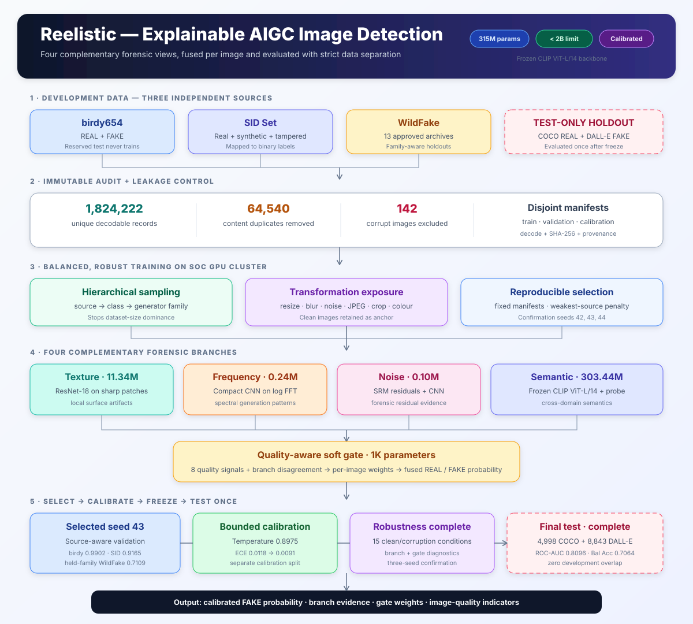

# Reelistic — AIGC Image Detector

Reelistic classifies an image as `REAL` (class 0) or AI-generated/manipulated
`FAKE` (class 1). It combines semantic, texture, frequency, and forensic-noise
evidence through a learned per-image gate and returns a calibrated FAKE
probability.

This README is the model card for the tested seed-43 reference checkpoint and
the current NPR-ResNet50 development leader. External-test statistics remain
attached to the tested reference; post-test candidates are selected using only
development validation. Experiment chronology and operational notes are
recorded in [JOURNAL.md](JOURNAL.md).



## Current tested reference

| Item | Specification |
|---|---|
| Checkpoint | `cluster_outputs/disagreement_full_seed43_20260829/best_ensemble_calibrated.pt` |
| Semantic evidence | Frozen CLIP ViT-L/14 + trainable MLP probe |
| Texture evidence | ResNet-18 over Laplacian-selected sharp patches |
| Frequency evidence | Compact CNN over log FFT magnitude |
| Noise evidence | Fixed SRM residuals + compact CNN |
| Fusion | Quality-aware softmax gate with eight image-quality signals and explicit branch disagreement |
| Calibration | Bounded temperature scaling, temperature `0.8975` |
| Decision threshold | `0.5` calibrated FAKE probability |
| Parameter count | `315,129,796` |
| Parameter limit | Hard failure above `2,000,000,000` |
| Development data | birdy654 + SID + approved WildFake families |
| Lightweight alternative | MobileNetV3 Small semantic backbone |

## Current development leader: seed-43 NPR-ResNet50

The leading post-test candidate changes **only the texture branch**. It replaces
raw RGB patches and ResNet-18 with neighboring-pixel-residual (NPR) patches and
ResNet-50. Frozen CLIP ViT-L/14, frequency evidence, standard noise evidence,
the disagreement-aware quality gate, sampling, augmentations, and calibration
protocol remain unchanged.

| Item | NPR-ResNet50 candidate |
|---|---|
| Completed checkpoint | `cluster_outputs/model_search_20260830/clip_l14_npr_resnet50/best_ensemble_calibrated.pt` |
| Completed seed | 43 |
| Training protocol | Five 100,000-draw balanced epochs on A100-80 |
| Texture representation | NPR residual patches |
| Texture backbone | ResNet-50 |
| Approximate parameter count | 329.53M, below the 2B hard limit |
| Confirmation | Seeds 42 and 44 use the same protocol; seed 43 is not retrained redundantly |

Matched development validation currently favors NPR-ResNet50:

| Metric | Tested reference | NPR-ResNet50 seed 43 | Delta |
|---|---:|---:|---:|
| Clean birdy654 AUC | 0.9890 | 0.9892 | +0.0002 |
| Clean SID AUC | 0.9165 | 0.9244 | +0.0079 |
| Clean WildFake AUC | 0.7338 | 0.8410 | +0.1072 |
| Weakest-source mean corruption AUC | 0.6787 | 0.7695 | +0.0908 |
| All source/condition mean AUC | 0.8567 | 0.8888 | +0.0321 |
| Severe-condition mean AUC | 0.8325 | 0.8554 | +0.0229 |

This is a substantial development-validation improvement, but seed 43 alone
cannot establish architecture stability. The tested reference remains the
default checkpoint until the matched seed-42/43/44 confirmation and a larger
operating-point diagnosis are complete. The COCO/DALL-E test is not reused to
choose between these candidates.

## Performance summary

The summary combines source-specific validation with official-path and
unique-content views of the external test:

| Evidence set | Samples | ROC-AUC | Balanced accuracy | TPR@1%FPR | Main interpretation |
|---|---:|---:|---:|---:|---|
| birdy654 validation | 4,971 | 0.9902 | 0.9478 | 0.8321 | Strong in-domain discrimination |
| SID validation | 591 | 0.9165 | 0.8371 | 0.5652 | Good transfer to synthetic/tampered data |
| WildFake held-family validation | 5,000 | 0.7109 | 0.6470 | 0.1156 | Main cross-family weakness |
| External COCO/DALL-E test, official paths | 13,841 | 0.8096 | 0.7064 | 0.2428 | Moderate transfer to an isolated external benchmark |
| External COCO/DALL-E test, unique content | 8,717 | 0.8138 | 0.7089 | 0.2495 | Similar ranking after duplicate removal |

ROC-AUC is the primary ranking metric. Balanced accuracy is emphasized because
the external test contains 4,998 REAL and 8,843 FAKE paths. TPR@1%FPR exposes
strict moderation performance that aggregate AUC can hide.

## Validation statistics

### Large clean source diagnosis

These results use the fixed 0.5 probability threshold and larger bounded
source samples than the transformation matrix below.

| Source | N | TP | TN | FP | FN | Accuracy | Balanced accuracy | REAL recall | FAKE recall | F1 | PR-AUC | ROC-AUC | ECE | Brier | Log loss |
|---|---:|---:|---:|---:|---:|---:|---:|---:|---:|---:|---:|---:|---:|---:|---:|
| birdy654 | 4,971 | 2,384 | 2,327 | 173 | 87 | 0.9477 | 0.9478 | 0.9308 | 0.9648 | 0.9483 | 0.9901 | 0.9902 | 0.0134 | 0.0393 | 0.1340 |
| SID | 591 | 334 | 164 | 36 | 57 | 0.8426 | 0.8371 | 0.8200 | 0.8542 | 0.8778 | 0.9585 | 0.9165 | 0.0537 | 0.1160 | 0.3643 |
| WildFake held families | 5,000 | 1,045 | 2,190 | 310 | 1,455 | 0.6470 | 0.6470 | 0.8760 | 0.4180 | 0.5422 | 0.7312 | 0.7109 | 0.1161 | 0.2404 | 0.7211 |

### Deployment operating points

| Source | TPR@1%FPR | Threshold | FPR@99%TPR | Threshold | ROC-AUC 95% CI |
|---|---:|---:|---:|---:|---:|
| birdy654 | 0.8321 | 0.9094 | 0.1512 | 0.2192 | [0.9885, 0.9921] |
| SID | 0.5652 | 0.9343 | 0.8250 | 0.0231 | [0.8902, 0.9356] |
| WildFake held families | 0.1156 | 0.8309 | 0.9856 | 0.0174 | [0.6972, 0.7237] |

Confidence intervals use 300 deterministic stratified bootstrap repetitions.
At a strict 1% false-positive budget, the WildFake true-positive rate is only
11.56%; cross-family low-FPR recall is therefore the model's clearest weakness.

### Clean validation performance by branch

This matched comparison uses the same fingerprints for every branch: 1,000
birdy654 images, all 591 SID validation images, and 1,000 held-family WildFake
images.

| Output | birdy654 AUC | SID AUC | WildFake AUC | Three-source mean AUC |
|---|---:|---:|---:|---:|
| **Fusion** | **0.9925** | **0.9165** | 0.6974 | **0.8688** |
| Texture | 0.9581 | 0.8057 | 0.5537 | 0.7725 |
| Frequency | 0.8597 | 0.6272 | 0.5670 | 0.6846 |
| Noise | 0.9104 | 0.6678 | **0.7093** | 0.7625 |
| Semantic | 0.9832 | 0.9162 | 0.6822 | 0.8605 |

The semantic branch supplies the strongest average individual evidence, but
the noise branch is the best clean WildFake expert. Fusion improves the
three-source mean and preserves birdy654/SID performance, although it trails
noise by 0.0118 AUC on the matched WildFake subset.

### Clean validation operating points by branch

| Source | Output | TPR@1%FPR | FPR@99%TPR |
|---|---|---:|---:|
| birdy654 | **Fusion** | **0.8600** | **0.1300** |
| birdy654 | Texture | 0.5740 | 0.4840 |
| birdy654 | Frequency | 0.2740 | 0.8460 |
| birdy654 | Noise | 0.4100 | 0.6980 |
| birdy654 | Semantic | 0.8040 | 0.2460 |
| SID | **Fusion** | **0.5652** | 0.8250 |
| SID | Texture | 0.2992 | 0.9450 |
| SID | Frequency | 0.0537 | 0.9700 |
| SID | Noise | 0.0128 | 0.9700 |
| SID | Semantic | 0.4092 | **0.7850** |
| WildFake | Fusion | 0.0860 | 0.9900 |
| WildFake | Texture | 0.0900 | 1.0000 |
| WildFake | Frequency | 0.1200 | 1.0000 |
| WildFake | **Noise** | **0.1620** | 0.9700 |
| WildFake | Semantic | 0.0560 | **0.9620** |

Fusion is strongest at strict operating points on birdy654 and has the highest
SID low-FPR recall. On matched WildFake, noise catches the most FAKE images at
1% FPR, while semantic reaches 99% FAKE recall with the lowest—but still very
high—REAL false-positive rate. This reinforces the need for domain-aware
routing rather than reliance on one global expert.

### Mean clean gate weights

| Source | Texture | Frequency | Noise | Semantic |
|---|---:|---:|---:|---:|
| birdy654 | 36.00% | 2.40% | 4.77% | 56.83% |
| SID | 34.05% | 3.09% | 6.70% | 56.17% |
| WildFake | 25.48% | 5.02% | 16.53% | 52.96% |

The gate raises noise weight on WildFake from 4.77% to 16.53%, showing that it
detects some domain shift. Semantic evidence still receives more than half of
the weight, which helps clean images but contributes to severe blur/downsample
routing errors.

### Calibration effect

| Metric | Before | After |
|---|---:|---:|
| Log loss | 0.1800 | 0.1790 |
| Brier score | 0.05307 | 0.05290 |
| Expected calibration error | 0.01180 | 0.00906 |

The bounded temperature is `0.8975`. Calibration changes probability quality,
not the underlying AUC ranking.

## Transformation impact

The table reports fusion ROC-AUC on fixed matched samples. Mean delta is
relative to the clean three-source mean AUC of 0.8688.

| Condition | birdy654 AUC | SID AUC | WildFake AUC | Mean AUC | Mean delta | WildFake TPR@1%FPR | WildFake FPR@99%TPR | Impact |
|---|---:|---:|---:|---:|---:|---:|---:|---|
| Clean | 0.9925 | 0.9165 | 0.6974 | 0.8688 | — | 0.0860 | 0.9900 | Reference |
| Colour shift | 0.9856 | 0.9177 | 0.6792 | 0.8608 | -0.0080 | 0.0840 | 0.9940 | Small |
| Centre crop 80% | 0.9838 | 0.9227 | 0.6246 | 0.8437 | -0.0251 | 0.0460 | 1.0000 | Moderate; mainly WildFake |
| Downsample 50% | 0.9757 | 0.9169 | 0.6289 | 0.8405 | -0.0283 | 0.0440 | 0.9920 | Moderate; mainly WildFake |
| Downsample 25% | 0.9310 | 0.9221 | 0.5862 | 0.8131 | -0.0557 | 0.0180 | 0.9900 | Severe |
| Blur 0.5 | 0.9893 | 0.9160 | 0.7091 | 0.8715 | +0.0027 | 0.0860 | 0.9880 | Neutral/slightly beneficial |
| Blur 1.0 | 0.9817 | 0.9172 | 0.6743 | 0.8577 | -0.0111 | 0.0500 | 0.9940 | Small |
| Blur 2.0 | 0.9374 | 0.9219 | 0.6220 | 0.8271 | -0.0417 | 0.0180 | 0.9900 | Severe |
| JPEG 90 | 0.9929 | 0.9175 | 0.6772 | 0.8625 | -0.0063 | 0.0880 | 0.9940 | Small |
| JPEG 70 | 0.9915 | 0.9187 | 0.6923 | 0.8675 | -0.0013 | 0.0680 | 0.9880 | Negligible |
| JPEG 50 | 0.9866 | 0.9181 | 0.6905 | 0.8651 | -0.0037 | 0.1560 | 0.9920 | Negligible AUC loss |
| JPEG 30 | 0.9746 | 0.9227 | 0.6278 | 0.8417 | -0.0271 | 0.1120 | 0.9980 | Moderate; mainly WildFake |
| Noise 0.02 | 0.9788 | 0.9170 | 0.6132 | 0.8363 | -0.0325 | 0.0700 | 0.9880 | Moderate |
| Noise 0.05 | 0.9731 | 0.9190 | 0.5689 | 0.8203 | -0.0485 | 0.0600 | 0.9940 | Severe |
| Noise 0.10 | 0.9387 | 0.9170 | 0.5602 | 0.8053 | -0.0635 | 0.0480 | 0.9920 | Largest AUC degradation |

### Transformation insights

- **SID is stable:** all 14 transformed SID AUCs remain between 0.9160 and
  0.9227. The aggregate corruption weakness is not caused by SID.
- **Additive noise is the largest risk:** noise 0.10 causes the lowest mean AUC
  and lowers WildFake AUC from 0.6974 to 0.5602.
- **Aggressive resizing removes useful forensic detail:** downsample 25%
  reduces birdy654 and WildFake performance while SID remains stable.
- **Severe blur creates a similar failure:** blur 2.0 lowers the mean by 0.0417.
- **Normal web JPEG is handled well:** JPEG 50–90 changes mean AUC by at most
  0.0063; JPEG 30 is more damaging because WildFake drops to 0.6278.
- **Mild blur is not harmful:** blur 0.5 slightly raises WildFake AUC and the
  three-source mean, suggesting that tiny high-frequency dataset artifacts are
  not the only signal used by the detector.
- **Cropping is domain-sensitive:** centre crop slightly improves SID but
  lowers WildFake by 0.0728, consistent with content/layout shortcut risk.

### Focused VQDM routing diagnosis

The semantic-mask ablation uses the same VQDM examples and removes semantic
evidence only at inference.

| Condition | Full fusion AUC | Semantic masked AUC | Mask delta |
|---|---:|---:|---:|
| Clean | 0.7372 | 0.6657 | -0.0716 |
| Downsample 25% | 0.6177 | 0.7553 | +0.1376 |
| Blur 2.0 | 0.6478 | 0.7231 | +0.0753 |
| JPEG 30 | 0.6659 | 0.6827 | +0.0168 |
| Noise 0.10 | 0.5875 | 0.5763 | -0.0112 |

Semantic evidence is valuable on clean VQDM but becomes harmful after severe
downsampling and blur. This is a routing limitation rather than evidence that
CLIP ViT-L/14 should be removed globally.

## External test statistics

The immutable external benchmark contains 4,998 COCO val2017 REAL paths and
8,843 DALL-E Advanced FAKE paths. Its SHA-256 audit found zero overlap with
1,824,222 development records. DALL-E contains 5,124 repeated same-label paths,
so both organizer path weighting and one-per-content-hash results are shown.

### Official 13,841-path fusion result

Confusion counts: 7,263 true FAKE, 2,956 true REAL, 2,042 false FAKE, and 1,580
missed FAKE.

| Metric | Result |
|---|---:|
| Accuracy | 0.7383 |
| Balanced accuracy | 0.7064 |
| REAL recall / specificity | 0.5914 |
| FAKE recall / sensitivity | 0.8213 |
| F1 | 0.8004 |
| PR-AUC | 0.8900 |
| ROC-AUC | 0.8096 |
| Expected calibration error | 0.0821 |
| Brier score | 0.1782 |
| Log loss | 0.5404 |
| TPR@1%FPR | 0.2428 |
| FPR@99%TPR | 0.9310 |

### Official test performance by branch

| Output | Accuracy | Balanced accuracy | REAL recall | FAKE recall | F1 | PR-AUC | ROC-AUC | ECE | Brier | Log loss | TPR@1%FPR | FPR@99%TPR |
|---|---:|---:|---:|---:|---:|---:|---:|---:|---:|---:|---:|---:|
| **Fusion** | **0.7383** | 0.7064 | 0.5914 | **0.8213** | **0.8004** | **0.8900** | **0.8096** | 0.0821 | **0.1782** | **0.5404** | **0.2428** | 0.9310 |
| Texture | 0.6450 | 0.6272 | 0.5634 | 0.6911 | 0.7132 | 0.8073 | 0.6867 | 0.1344 | 0.2396 | 0.7189 | 0.1057 | 0.9840 |
| Frequency | 0.6520 | 0.6556 | 0.6689 | 0.6424 | 0.7023 | 0.7795 | 0.7070 | **0.0205** | 0.2204 | 0.6326 | 0.0292 | 0.9388 |
| Noise | 0.6994 | **0.7130** | **0.7621** | 0.6639 | 0.7384 | 0.8552 | 0.7542 | 0.0907 | 0.2133 | 0.6226 | 0.1403 | 0.9892 |
| Semantic | 0.7109 | 0.6773 | 0.5562 | 0.7984 | 0.7792 | 0.8740 | 0.7801 | 0.0942 | 0.1927 | 0.5716 | 0.2354 | 0.9416 |

Mean test gate weights are 57.26% semantic, 31.85% texture, 7.67% noise, and
3.22% frequency. Fusion provides the best AUC, PR-AUC, F1, Brier score, and log
loss. Noise provides the best balanced accuracy and REAL recall; frequency is
the best-calibrated individual branch.

### Duplicate-aware 8,717-content result

| Metric | Official paths | Unique content |
|---|---:|---:|
| Sample count | 13,841 | 8,717 |
| Accuracy | 0.7383 | 0.6916 |
| Balanced accuracy | 0.7064 | 0.7089 |
| REAL recall | 0.5914 | 0.5914 |
| FAKE recall | 0.8213 | 0.8263 |
| F1 | 0.8004 | 0.6957 |
| PR-AUC | 0.8900 | 0.7974 |
| ROC-AUC | 0.8096 | 0.8138 |
| ECE | 0.0821 | 0.1080 |
| Brier score | 0.1782 | 0.2092 |
| Log loss | 0.5404 | 0.6320 |
| TPR@1%FPR | 0.2428 | 0.2495 |
| FPR@99%TPR | 0.9310 | 0.9222 |

The similar AUC and balanced accuracy show that duplicate path weighting does
not create the headline ranking result. Accuracy, F1, and PR-AUC change because
the unique-content class balance is different.

### External-test interpretation

Every REAL image is COCO and every FAKE image is DALL-E, so source and label
are coupled. The result measures transfer to this frozen benchmark but cannot
fully separate generator evidence from COCO-versus-DALL-E domain cues. REAL
recall of 0.5914 also shows that domain-shifted real images remain a practical
false-positive concern.

## Tested reference architecture

```text
Input image
  ├── Texture: Laplacian-selected patches → trainable ResNet-18
  ├── Frequency: log FFT magnitude → compact CNN
  ├── Noise: fixed SRM residuals → compact CNN
  └── Semantic: frozen CLIP ViT-L/14 → trainable MLP probe
             ↓
Four branch logits + eight image-quality signals + branch disagreement
             ↓
Quality-aware softmax gate + branch dropout + branch scales
             ↓
REAL/FAKE fusion logits
             ↓
Bounded temperature calibration
             ↓
Calibrated probability of FAKE
```

The training objective combines fused and branch classification losses,
supervised contrastive texture loss, and a reliability penalty that activates
when fusion is worse than detached semantic evidence. Hierarchical sampling
balances expected exposure by source, then class, then generator family.

## Data protocol

The authoritative cluster data layout is:

```text
~/TechJam/Dataset/
├── birdy654/
├── external_pilot/                 # SID development subset
├── WildFake/
│   ├── raw/                        # approved training archives
│   └── final_test/                 # isolated COCO/DALL-E benchmark
└── manifests/                      # train/validation/calibration/test JSONL
```

Safeguards include image decoding, SHA-256 hashing, content deduplication,
provenance, deterministic source/family splits, relative-path validation, and
test-directory exclusion. Training uses only the development manifests. The
external manifest is accepted only by the dedicated holdout evaluator.

## Repository map

| Path | Purpose |
|---|---|
| `aigc_detector/models/` | Four evidence branches, disagreement-aware fusion, and seed ensemble |
| `aigc_detector/data/` | Dataset loading, transformations, handcrafted features, and hierarchical sampling |
| `aigc_detector/metrics.py` | Confusion, ranking, calibration, ROC/PR, and operating-point metrics |
| `aigc_detector/calibration.py` | Bounded temperature scaling |
| `aigc_detector/train.py` | Local trainer and bounded smoke training |
| `aigc_detector/robustness.py` | Source/condition branch and fusion evaluation |
| `aigc_detector/predict.py` | Batch prediction for arbitrary image folders |
| `cluster/` | Dataset, audit, training, diagnosis, calibration, and evaluation entry points |
| `slurm/` | Titan V and A100 job launchers |
| `tests/` | Data-safety, metrics, sampling, model, fusion, and calibration tests |
| `JOURNAL.md` | Development chronology, experiment decisions, and cluster operations |

## Local setup

```bash
cd /Users/bryan03/Desktop/TiktokTechjam26Reelistic
python3 -m venv .venv
source .venv/bin/activate
python3 -m pip install -r requirements.txt
python3 -m unittest discover -s tests -p 'test_*.py' -v
```

Full CLIP ViT-L/14 training belongs on the cluster. MobileNetV3 Small can be
used for bounded Mac smoke training:

```bash
python3 -m aigc_detector.train \
  --data-dir Dataset \
  --semantic-backbone mobilenetv3_small_100.lamb_in1k \
  --epochs 1 \
  --batch-size 16 \
  --max-train-samples 512 \
  --max-val-samples 200 \
  --max-calibration-samples 200 \
  --skip-test \
  --output-dir local_results/smoke
```

## Cluster training

Connect off campus with NUS VPN and the jump host:

```bash
ssh -J bryanngu@stujump.comp.nus.edu.sg bryanngu@xlogin.comp.nus.edu.sg
cd ~/TechJam
```

Train the selected CLIP ViT-L/14/ResNet-18 architecture on A100:

```bash
OUTPUT_DIR="$HOME/TechJam/cluster_outputs/l14_seed47" \
SEED=47 \
sbatch slurm/train_three_source_l14_a100.sbatch
```

Test another compatible semantic or texture backbone without editing the
launcher:

```bash
OUTPUT_DIR="$HOME/TechJam/cluster_outputs/candidate_clip_b32_seed47" \
SEMANTIC_BACKBONE=clip_vit_b32 \
TEXTURE_BACKBONE=resnet18 \
SEED=47 \
sbatch slurm/train_three_source_l14_a100.sbatch
```

Supported semantic aliases include `clip_vit_l14`, `clip_vit_b32`,
`dinov2_vitl14`, and `dinov2_vits14`; compatible `timm` identifiers are also
accepted. A different architecture may use `INIT_CHECKPOINT` for compatible
name-and-shape tensor transfer. Resume the same architecture/run with:

```bash
OUTPUT_DIR="$HOME/TechJam/cluster_outputs/l14_seed47" \
RESUME="$HOME/TechJam/cluster_outputs/l14_seed47/latest_training.pt" \
sbatch slurm/train_three_source_l14_a100.sbatch
```

Every candidate uses a new output directory. Model replacement decisions use
only development validation and robustness manifests; the external benchmark
is not a model-selection set.

## Predict your own images

The selected seed-43 checkpoint is hosted on Hugging Face at
[bryan3112/reelistic-seed43](https://huggingface.co/bryan3112/reelistic-seed43).
Download it (about 1.2 GB) without cluster access:

```bash
python3 -c "
from huggingface_hub import hf_hub_download
hf_hub_download('bryan3112/reelistic-seed43',
                'best_ensemble_calibrated.pt',
                local_dir='cluster_results/seed43')
"
```

`huggingface_hub` is already included in `requirements.txt`. The download is
cached, so later runs reuse the local copy.

Cluster users can instead copy the original artifact directly:

```bash
mkdir -p cluster_results/seed43
rsync -avP \
  -e "ssh -J bryanngu@stujump.comp.nus.edu.sg" \
  bryanngu@xlogin.comp.nus.edu.sg:~/TechJam/cluster_outputs/three_source_l14_seed43_full_20260829/best_ensemble_calibrated.pt \
  cluster_results/seed43/
```

Put `.jpg`, `.jpeg`, `.png`, `.bmp`, or `.webp` images in any folder, then run:

```bash
python3 -m aigc_detector.predict \
  --image-dir data/example \
  --checkpoint cluster_results/seed43/best_ensemble_calibrated.pt \
  --output-json predictions.json
```

`pred` in `predictions.json` is the calibrated FAKE probability. Values at or
above 0.5 are classified as FAKE. The predictor automatically chooses CUDA,
Apple MPS, or CPU.

## Result artifacts and integrity

Cluster result files:

```text
cluster_outputs/disagreement_full_seed43_20260829/best_ensemble_calibrated.pt
cluster_outputs/disagreement_seed43_gate2_gate3_20260829/diagnosis.json
cluster_outputs/matched_three_seed_robustness_20260829/disagreement_seed43/
cluster_outputs/final_test/final_test_metrics.json
cluster_outputs/final_test/final_test_unique_metrics.json
Dataset/WildFake/final_test/manifests/audit.json
```

| Artifact | SHA-256 |
|---|---|
| Final audit | `e1db688149ab3c9bc0a7f9841e81a714a6af4093ebc3f5b33654ded24de18068` |
| Official manifest | `2683ea5d2dead58228684b7872be4beb8b3e8860fbe58376ef76bd13dc1643d8` |
| Unique manifest | `3aa5083611caaffc135aa749f96fe4cc7512dee8dc915fc3f1ff2d1b3d5a2a7d` |
| Official metrics | `b57d964a73ca67436593f4df6c1513c37743942ba3aa63c144b1d73a60418603` |
| Unique metrics | `8889c7c701fddd838a6e4dfc087197c75e68c32a5d9233a52e2363e348ac57d2` |
